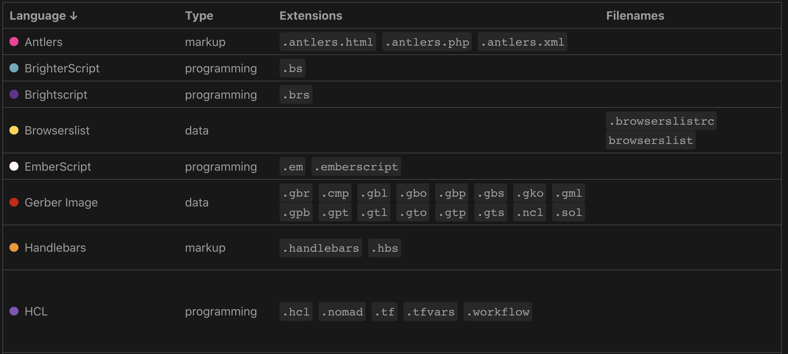

# Linguist Language Visualization

A simple visualization of all of the Linguist languages (the languages recognized by GitHub). Built with Vue & GitHub Actions.

### Development

#### Requirements
* Node v18+ (built with 18.13.0)

#### Scripts
* `start`: runs the app in development mode
* `build`: builds the app for production.
* `deploy`: deploys the app to GitHub pages

### Acknowledgments
- __Visualizes__ the [Linguist](https://github.com/github/linguist/blob/master/lib/linguist/languages.yml) language data
